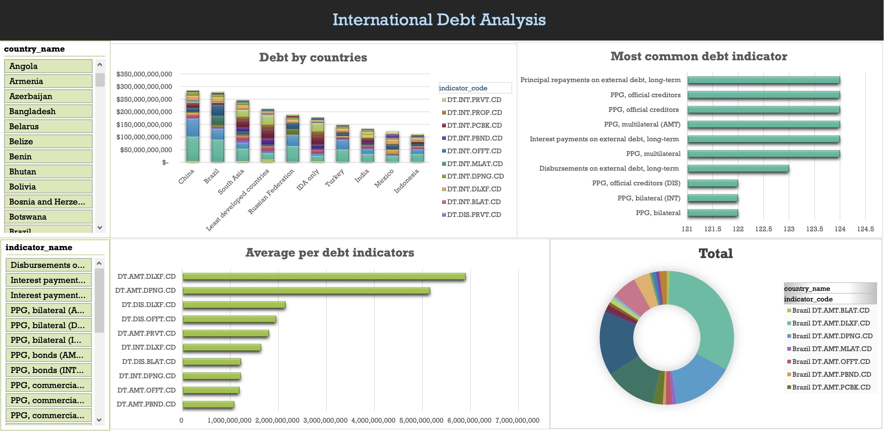

# The World Bank's international debt data

This project was designed to analyse international debt data collected by The World Bank, which is the organization that provides debt to countries. 

## The dataset

The dataset contains information about the amount of debt (in USD) owed by developing countries across several categories. The dashboard was created to find the answers to questions like:

1. The amount of debt owed by the countries

   The **_Debt by countries_** chart shows the amount of debt owed by the first 10 countries and how the debt categories build up this amount.

2. The most common debt indicator

   The **_Most common debt indicator_** chart shows the 10 most common debt indicators. We can see that the long-term debt is the top most category with the highest amount.

3. Average amount of debt across indicators

   The **_Average per debt indicator_** chart illustrates the top 10 average amount of debt across categories.

4. Amount of debt per specific country

   The **_Total debt per specific country_** chart shows the amount of debt owed by a specific country per category of debt

## Resources Used
- **Microsoft Excel** for Microsoft 365 MSO (Version 2205)
- **DataCamp** 

